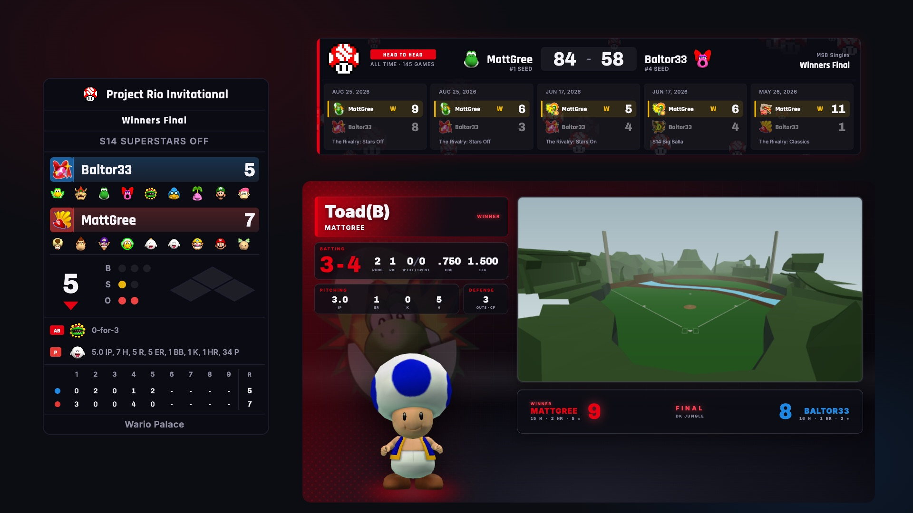
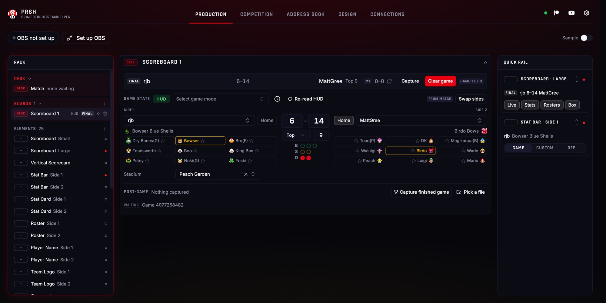

# Project Rio Stream Helper (PRSH)




A stream overlay manager for **Mario Superstar Baseball (MSB)** played through [Project Rio](https://www.projectrio.online/). PRSH runs a local web server that combines the **live game data** written by the Project Rio client with **stats and game history** from the Project Rio web API, and serves the result as OBS browser sources that update in real time. A browser-based console controls what is on air and drives OBS directly.

A video walkthrough of installation, setup and every element is available on YouTube: [Streaming Mario Baseball will never be the same…](https://www.youtube.com/watch?v=YWKA3s5S9OI)

PRSH is forked from [TournamentStreamHelper](https://github.com/TournamentStreamHelper/TournamentStreamHelper) and rebuilt as a single-game web app.

---

## Features

**Game data**
- The local game follows Project Rio's HUD file pitch by pitch: score, inning, count, runners, batter and pitcher, rosters and per-character stats.
- Live games from other players follow the Project Rio API, and completed games can be searched by game mode, player, opponent and date.
- Season stats for the characters on the field are pulled from the Project Rio stats database for the game mode being played.
- Finished local games are captured automatically from the stat file Project Rio writes, which records each at-bat and each batted ball's trajectory.

**Scoreboards and matches**
- Any number of scoreboards run side by side. Each one shows a single game or rotates through a pool of games that refreshes on a timer.
- A **match** (Bo1, doubleheader, Bo3, Bo5 or Bo7) holds the players, captains, controller ports, game mode and bracket round before the game starts. Captured games credit its series.
- Matches are arranged in one or more **running orders**. A scoreboard takes the next waiting match in one step.
- start.gg events load onto the Competition tab, and any set can be turned into a match.

**Broadcast elements**
- 19 elements across scoreboards, stats, rosters, names, logos, commentary, schedules, head-to-head history, results, brackets, post-game graphics, a 3D hit visualizer and controller input. See [Elements](#elements).
- **Demo mode** fills every element with sample data, so scenes can be built with no game running.

**OBS control**
- Sources are created, shown, hidden, removed and resized from the console. Every scene PRSH has sources in is listed with them.
- Paired elements (Side 1 / Side 2) can be sized to match each other exactly, and a stretched source can be redrawn at the size it is actually displayed.
- Confirm mode stages changes and sends them on air together.
- Everything except OBS control works with OBS closed, and every element has a URL that can be added as a Browser Source by hand.

**People and leagues**
- The Address Book stores each player's display name, tag, pronouns, location, socials and Rio username, and fills them in on every element.
- A league gets its own book with its game modes and a logo per player. Its logos replace the in-game team logos in that league's games, and the book can be exported and shared as one file.

**Design**
- Swappable theme packages (**Default**, **Classic**, or your own SVG package), saved presets, three typography roles, custom controller port colors and per-element style overrides.

**Access**
- Runs on macOS and Windows. The console can optionally be opened from any phone, tablet or computer on the same network.

---

## Install

Download a build from the [latest release](https://github.com/matt-gree/ProjectRioStreamHelper/releases/latest):

- **macOS**: `PRSH-macOS-arm64.zip` (Apple Silicon) or `PRSH-macOS-x86_64.zip` (Intel). Unzip it and move `PRSH.app` to Applications.
- **Windows**: `PRSH-Setup.exe`. Run the installer.

PRSH is not code-signed, so the first launch needs a nudge: on macOS right-click `PRSH.app` and choose **Open**, then **Open** again; on Windows choose **More info** then **Run anyway**. Once per install.

On launch, PRSH opens the console in the default browser at `http://localhost:5260`. On macOS it runs from a menu-bar icon. On Windows it runs from a small taskbar window, and closing that window quits PRSH.

If port 5260 is already in use, PRSH offers to move to the next free port and remembers the choice.

---

## Quick start

1. **Install the MSB image pack** — Connections → MSB image pack → **Import…**. Without it, character art and team logos are missing everywhere. [Details](#msb-image-pack-required)
2. **Point PRSH at Project Rio** — Connections → Project Rio. The HUD file is usually found automatically; if not, select it with **Browse…**. [Details](#project-rio)
3. **Connect OBS** — enable the WebSocket server in OBS under Tools → WebSocket Server Settings, then enter its connect info under Connections → OBS. [Details](#obs)
4. **Add your first overlay** — on the Production tab, press **+** on the scene you want it in and choose **Scoreboard**. Switch on **Sample** to see it filled with demo data before a game starts.

Then start a game in Project Rio: the scoreboard follows it pitch by pitch.

---

## Setup

Everything PRSH connects to outside itself is configured on the **Connections** tab. It is normally set once per machine.

### Project Rio

PRSH reads `decoded.hud.json`, the file Project Rio rewrites after every pitch. Default locations:

- macOS: `~/Library/Application Support/Project Rio/HudFiles/decoded.hud.json`
- Windows: `%APPDATA%\Project Rio\HudFiles\decoded.hud.json`

If Project Rio is installed elsewhere, select the file with **Browse…**. **Follow on Scoreboard 1** puts the local game on Scoreboard 1. With it off, Scoreboard 1 behaves like any other board and takes its games from the API. **Refresh** reloads the list of Project Rio game modes, which is otherwise fetched once at startup.

### OBS

PRSH controls OBS through obs-websocket, which ships with OBS 28 and later.

1. In OBS, open **Tools → WebSocket Server Settings** and enable **Enable WebSocket server**.
2. Open **Show Connect Info** and enter the **Server IP**, **Port** and **Server Password** in PRSH.
3. Select **Save & Connect**. With **Auto-connect** on, PRSH reconnects at startup and keeps retrying until OBS is open.

The connection runs from the browser the console is open in, so it works whether OBS is on the same machine or not.

### Network (phone / tablet / streaming machine)

Turn on **Allow LAN access** and restart PRSH, and any phone, tablet, or computer on your WiFi can open the app and run your stream.

### MSB image pack (required)

PRSH does **not** ship Mario Superstar Baseball images (Nintendo IP). The pack is available in the [Mario Superstar Baseball Discord](https://discord.gg/WfkYyaHBEu). Without it, character art, team logos and game icons do not appear in the console or the overlays.

To install it, unzip the pack and select the folder with **MSB image pack → Import…**. PRSH locates the pack inside the selected folder (a wrapper folder from the zip is fine) and copies it into its own data folder. **Browse…** instead points PRSH at a folder that stays where it is, which suits a pack shared with other tools. The card lists any missing files per category.

The pack has five folders. Files are named by their Project Rio ID, not by name:

| Folder | Contents | Files |
|---|---|---|
| `characterIcons/` | Character icons (rosters, scoreboards) | `0.png`–`53.png` (54) |
| `characters/` | Full character renders (post-game graphics) | `0.png`–`53.png` (54) |
| `captains/` | Captain art, keyed by character ID | 12 |
| `teamLogos/` | In-game team logos | `0.png`–`47.png` (48) |
| `gameIcons/` | Game sprites | `bat.png`, `glove.png`, `superstar.png` |

PRSH's copy is stored in:

- **macOS**: `~/Library/Application Support/PRSH/user_data/game_assets/msb/`
- **Windows**: `%LOCALAPPDATA%\PRSH\user_data\game_assets\msb\`
- **From source**: `./user_data/game_assets/msb/`

### Controller reader

The Controller element is drawn by [gc-overlay](https://github.com/matt-gree/gc-overlay), a standalone controller-input reader that is bundled with PRSH and runs as a separate process on macOS and Windows. Start it from the **Controller reader** card. **Start with PRSH** launches it on every startup. The default port is 8069.

---

## The Production tab

The Production tab is the main console, with three columns:



- **Rack** (left): matches, scoreboards, and each OBS scene with the PRSH sources in it. With OBS disconnected, it lists every element instead.
- **Stage** (center): the controls for whatever is selected in the rack.
- **Quick rail** (right): cards pinned for quick access during a broadcast.

### Adding sources

The **+** on a scene header opens the element picker. The picker supports arrow-key navigation, and a source can be added visible or hidden. Once added, a source can be shown, hidden or removed from its rack row. Elements that animate in replay their entrance each time they are shown. A per-source **Intro** setting keeps a source loaded instead, with no entrance animation.

The **Sample** switch turns on demo mode. While it is on, every element shows its sample data and a banner warns that sample data is on air.

### Scoreboards

A scoreboard holds one game at a time. Boards are added from the **+** in the rack's **Boards** section, and at least one always exists. Every scoreboard-based element has a **Board** setting that chooses which scoreboard it shows.

Where a board's game comes from is decided automatically: Scoreboard 1 follows the local HUD file while **Follow on Scoreboard 1** is on, and every other board takes its games from the Project Rio API. API boards have two playback modes:

- **One game**: select a live or completed game to keep on the board. A live game is re-read from the API every 10 seconds until it ends.
- **Rotating**: build a pool from filters (game mode, player, opponent, and for completed games a date range and limit), then cycle through it. **Seconds per game** sets the pace (5–600 s). **Keep pool current** re-runs the filters on an interval (10–600 s) so new games join and finished or non-matching ones leave. Games can be excluded from the pool individually.

A board's game mode is set by the game it carries, and can be overridden by hand. The game mode also decides which season's stats the stat elements show.

### Matches

A match is a fixture that exists before and after its games. It carries:

- Both players (from the Address Book), with optional captains and controller ports.
- The game mode, bracket phase and round.
- The format: **Bo1**, **DH** (doubleheader: two games, and a 1-1 split is a complete, undecided result), **Bo3**, **Bo5** or **Bo7**.
- The series score, credited automatically as games are captured.

Binding a match to a scoreboard labels it immediately: names, captains and team logos appear before the first pitch. When the game starts, live data fills in the rest, and the match still decides which player is on which side. A match can be bound to only one board at a time.

Matches live on the **Match** panel in one or more **running orders** (for example, winners and losers bracket orders). Each scoreboard draws from one order, and **Put on board** binds the next waiting match. The **Upcoming Schedule** element shows the order on stream, with an optional start time per match. **Clear** removes finished matches.

### Stats

The **Stat Bar** (wide) and **Stat Card** (2×2) show four headline stats for the character currently batting or pitching on each side. Stats come from the Project Rio stats database for the board's game mode. The bottom line shows that character's line in the current game, or a custom caption. Stats are fetched once per game and can be refreshed from the board.

### Post-game

When a local game ends, PRSH reads the stat file Project Rio writes and captures the game for its board. Capture can be turned off in **Settings**. A board can also capture a finished game on demand, or load a stat file directly.

- **Game Summary** presents the final score and each side's key performers.
- **Character Spotlight** replays one character's plate appearances in the 3D hit visualizer and finishes on their spray chart and final line. PRSH suggests a character, the winning side's leader in total bases, and the producer can pick any other.

Post-game capture needs a stat file from a game played on the local machine. Games from the API cannot be captured.

### Sizing sources in OBS

An OBS browser source has two sizes: the resolution the page renders at, and the size OBS scales the result to on the canvas. Dragging a source's handles changes only the second one, which blurs text when enlarged and shrinks it when reduced.

- **Redraw**: PRSH detects a stretched source and re-renders it at the size it occupies on the canvas, without moving it. A stretched **Player Name** is flagged in the rack, because its text size is set in pixels. Redrawing a Player Name keeps the text size it appeared at.
- **Match size**: for elements that come in pairs (Stat Bar, Stat Card, Roster, Player Name, Team Logo, Controller), the panel of one side can resize its source to exactly match the other side's.
- **Copy URL**: every source's panel shows its browser-source URL, including with OBS closed.

---

## Elements

| Element | What it shows |
|---|---|
| **Scoreboard** | Score, inning, count, runners, batter and pitcher. **Small** is a compact bar; **Large** adds rosters, live stats and a linescore. |
| **Vertical Scorecard** | A tall scorecard with a selectable main block (full, rosters, condensed or off), linescore, stadium and date. |
| **Stat Bar** / **Stat Card** | Season stats for the character on the field, per side. |
| **Roster** | A side's nine characters, with the current batter or pitcher highlighted. |
| **Player Name** | A side's name, with an optional tag or sponsor prefix. |
| **Team Logo** | A side's league logo, in-game team logo or captain. |
| **Commentary** | Commentator name plates from the Address Book, with socials and pronouns. |
| **Player Plates** | Name plates for both players, with Address Book details. |
| **Character Spotlight** | A post-game at-bat replay for one character in the hit visualizer. |
| **Game Summary** | A post-game summary of the final score and top performers. |
| **Lower Third** | A band of up to five slots: logo, match, score box, merch, clock, message or bracket. |
| **Upcoming Schedule** | The running order, with times and live status. |
| **Matchup History** | The two players' head-to-head record and their five most recent games. |
| **Bracket** | A start.gg bracket phase. |
| **Results Ticker** | A scrolling ticker of completed game results. |
| **Event Header** | Header and footer bands with event name, phase, date, location, socials and custom text. |
| **Hit Visualizer** | The last batted ball's trajectory in a 3D model of the stadium. |
| **Controller** | Live GameCube controller input per side, following each player's port. |

Per-side elements take a `?team=1|2` parameter and scoreboard elements a `?scoreboard=N` parameter. A missing `scoreboard` means Scoreboard 1.

---

## Sides

Each board has two **sides**, and every surface uses the same numbering. The Side 1 player is Side 1 on the scoreboard, the match, the name plates and the controller. The labels can be changed in **Settings → General** to *Left / Right* or *Top / Bottom*.

Project Rio assigns away and home at random each game, so PRSH decides which player sits on which side. The first rule that applies wins:

1. **Manual**: **Swap sides** on the board. Lasts until the game ends, or until **Use auto** hands the decision back.
2. **Match**: the bound match's side assignment.
3. **Pin**: a player's preferred side, set in the Address Book. If both players prefer the same side, this rule is skipped.
4. **Back-to-back**: a returning player keeps the side they had in the previous game.

The board shows which rule decided. Controller sources follow the player rather than the port, so a player who picks port 2 still appears on their own side.

---

## Competition and the Address Book

### Competition

The **Competition** tab loads a start.gg event by URL or slug and fills in the event's details (name, location, date, organizers, phase). It lists the event's **Entrants**, which can be added to the Address Book, and its **Sets**, where **Load to Match** creates a match with the set's players, round and phase.

### Address Book

The Address Book is PRSH's player registry. Each person has a display name, tag, pronouns, country and state, socials, and a **Rio username**. The Rio username links a person to live games, so their details appear on every element automatically. Entrants imported from start.gg keep their start.gg details, and only need a Rio username added. A player's preferred side (see [Sides](#sides)) is also set here.

The Address Book can hold several **books**. A league book is linked to the Project Rio game modes the league plays and stores a logo per player. In games of those modes, league logos replace the in-game team logos, and a player's tag line comes from the league book. A book can also be filled from a Project Rio community's member list.

Books are exported and imported as a single `.prsh-book.zip` with logos included, so one person can maintain a league's book and share it. Importing a book always creates a new book and never changes existing ones.

---

## Design

The **Design** tab controls the appearance of every element.

- **Theme packages**: **Default** and **Classic** ship with PRSH. A package is a set of SVG files, one per element, and anything a package does not provide falls back to Default. Custom packages are installed into the user data folder. See `.claude/skills/design-package-authoring/` for the package format.
- **Presets** save the theme, all design settings, per-element style settings and the logo together, and switch between them in one step.
- **Typography**: three font roles apply across all elements: **display** (names, titles), **body** (captions) and **mono** (scores, stats).
- **Controller ports**: the four port colors default to the GameCube colors and can be changed. Elements that tint by side use these colors.
- **Style overrides**: an element's panel can override individual design settings (font, colors, border, shadow) for that element only.

---

## Settings & data

**Settings** has:

- **General**: the side labels.
- **Production**: confirm mode (with a configurable hotkey, **F9** by default) and automatic post-game capture.
- **Output**: text-file export. Every state value is mirrored to a `.txt` file in `user_data/stream_labels/` for OBS Text Sources. Off by default.
- **Help & recovery**: logs, the welcome checklist, announcements, and **Reset boards and matches**.

PRSH stores its data in `~/Library/Application Support/PRSH/user_data/` on macOS, `%LOCALAPPDATA%\PRSH\user_data\` on Windows, and `./user_data/` when running from source:

| Path | Contents |
|---|---|
| `settings.json` | Preferences, scoreboards and design |
| `state.json` | Current scoreboard, match and element state. If PRSH fails to start because this file is corrupt, replace its contents with `{}`. |
| `participants.json` | The Address Book |
| `branding/` | Tournament, preset and league logos |
| `game_assets/msb/` | The MSB image pack |
| `stream_labels/` | Text-file export (when enabled) |

Logs are written to a `logs/` folder beside `user_data/`, and **Settings → Help & recovery → Logs** opens it.

PRSH checks GitHub for new releases and project announcements and shows them in the app. **Settings → Help & recovery → Announcements** clears them.

---

## Updating

PRSH tells you when a new release is out, but does not update itself. Download the new build and install it over the old one: on Windows the installer upgrades in place, and on macOS replace `PRSH.app` in Applications.

Your data is left alone. Settings, the Address Book, branding and the MSB image pack live in `user_data/`, outside the application itself, and carry across updates.

---

## Troubleshooting

**A browser source is blank.** Overlays hide themselves when they have nothing to draw, so this is often correct: a Scoreboard whose board has no game draws nothing. To find out which it is, copy the source's URL from its panel, open it in a browser and look at the console — the overlay logs the reason it is blank.

**An overlay is showing the wrong game.** Scoreboard elements have a **Board** setting, and a source added without one follows Scoreboard 1. Check the board on the source's panel.

**Stats are empty.** The stat elements read the Project Rio stats database for the board's game mode, so a board with no game mode yet has nothing to look up. Set the mode by hand on the board. Stats are fetched once per game and can be refreshed from the board panel.

**The Controller element shows nothing.** The controller reader is a separate process — start it from **Connections → Controller reader**. The element follows the player's port, which is set on the match.

**A player's details do not appear.** PRSH matches people by **Rio username**, so the Address Book entry has to carry the exact username Project Rio reports for that player.

---

## Run from source

```bash
# One-time setup
npm run setup          # macOS / Linux
npm run setup:win      # Windows

# Dev mode (Vite + FastAPI)
npm run dev            # macOS / Linux
npm run dev:win        # Windows
```

- Console (Vite dev server): `http://localhost:5173`
- API, overlays and the built console: `http://localhost:5260`

```bash
./venv/bin/python -m pytest    # backend tests
npm run test:run               # frontend tests
npm run vite:lint              # lint
```

Backend: FastAPI, python-socketio and [pyrio](https://github.com/matt-gree/pyrio). Frontend: React 19, Zustand, Tailwind and Vite. Overlays are static HTML under `public/layout/`, themed by the SVG packages in `public/design/`. The Hit Visualizer uses [RioVisualizer](https://github.com/matt-gree/RioVisualizer).

For architecture, performance rules and conventions, see [CLAUDE.md](CLAUDE.md) and [TESTING.md](TESTING.md).

---

## Support

Questions, bug reports and feature requests are welcome in the [Mario Superstar Baseball Discord](https://discord.gg/WfkYyaHBEu) or as [GitHub issues](https://github.com/matt-gree/ProjectRioStreamHelper/issues).

PRSH and Project Rio can be supported on [Patreon](https://www.patreon.com/projectrio). Development updates are posted on [MattGree's YouTube channel](https://www.youtube.com/@MattGree).

---

## License

MIT. See [LICENSE](LICENSE).

PRSH is not affiliated with, endorsed by or sponsored by Nintendo. Mario Superstar Baseball and its characters are Nintendo's, and no game assets are distributed with PRSH.

PRSH is a fork of the web version of [TournamentStreamHelper](https://github.com/TournamentStreamHelper/TournamentStreamHelper) by Samantha Chalker, rebuilt as a single-game web app for Mario Superstar Baseball, and carries code adapted from the earlier [Qt version](https://github.com/joaorb64/TournamentStreamHelper) by João Ribeiro Bezerra. Both are MIT-licensed and their copyright notices are retained in [LICENSE](LICENSE) as that licence requires.
